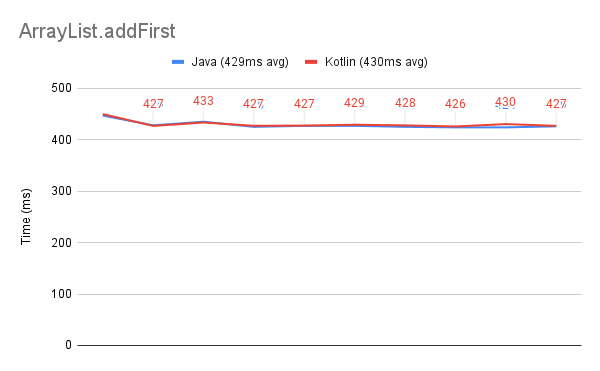
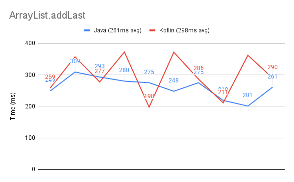

# KuriousAboutKotlin
#### Profilin Comparin Kotlinin

Note: These are observations, I'm not sure why the performance characteristics are the way they are, but they are 
interesting.  

## Comparin
### For Loops

Add 1B numbers together in a for loop. 
* Kotlin is 25% faster than Java in this test.

### ArrayList

Add 100,000 elements into an Arraylist from the front. 

Add 20 million elements into an Arraylist from the back.

* addFirst is equivalent
* addLast has similar average time, but Kotlin is much more spiky

### Generate LinkedList

Add 100 million elements in a LinkedList chain

* Average time is basically the same, but again Kotlin is a bit spikier

### Recursion (fibonacci)

Generating the first 35-45 fibonacci numbers

* basic recursion and addition look identical in Java and Kotlin

### Concurrency

ExecutorService for Java and coroutines for Kotlin. Concurrently process 100,000 tasks that only had a 100ms delay.

* Kotlin coroutines were 25x faster than Java on this
* Coroutines are meant to be extremely lightweight and this is a best case scenario for them

ExecutorService for Java and coroutines for Kotlin. Concurrently compute the fibonacci numbers from 32-42.

* Very interesting that Java was ~8x faster for this task
* It looks like for compute heavy tasks, Java ExecutorService may be a better choice than Kotlin coroutines
